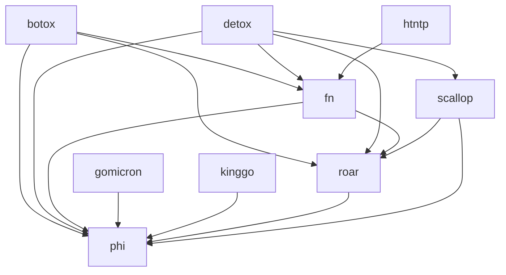

# went

**went** (past tense of the verb **go**) refers to the idea that using the
standard library of Golang is a thing of the past.

This project contains several libraries that can be used individually.

- [botox](./botox/README.md): DI framework using generics
- [detox](./detox/README.md): Mock framework using generics
- [fn](./fn/README.md): Functional patterns utilities
- [gomicron](./gomicron/README.md): Helpers to simplify onsi/gomega custom matcher creation
- [htntp](./htntp/README.md): Standard http library helpers 
- [kinggo](./kinggo/README.md): Test helpers for onsi/ginkgo
- [phi](./phi/README.md): Reflection utilities
- [roar](./roar/README.md): Standardized error struct
- [scallop](./scallop/README.md): Slice utilities

We aim at minimizing third party dependencies.

> At the moment, those include:
> - onsi/ginkgo (only for testing purposes + testing library)
> - onsi/gomega (only for testing purposes + testing library)
> - samber/lo

We also allow cross-references between the libraries.
Also, all libraries (apart from `kinggo` and `gomicron` themselves) should/could 
depend on `kinggo` and `gomicron` to build their tests.

# TODO: gomicron
- message builder dynamic factory using interfaces and complete since beginning
- create gomicron lib to simplify custom matchers creation

# TODO: detox
- create gomega matchers

# TODO: fn
- tests
- documentation

# TODO: phi
- review assertion vs validation
- tests interface

# TODO: roar
- review accumulate -> maybe a way to accumulate error
- stack trace
- tests

# TODO: scallop
- consider knife as package name

# TODO: thong (NEW PACKAGE)
- consider rope as package name
- indent text

# TODO: botox
- allow for local container
- reset a specific dependency
- new container
- allow for deep copy (example: resolve child singleton should not resolve parent container)



# Getting Started

## Usage

```shell
go get "github.com/SamuelCabralCruz/went"
```

## Contributing

```shell
make install
```
