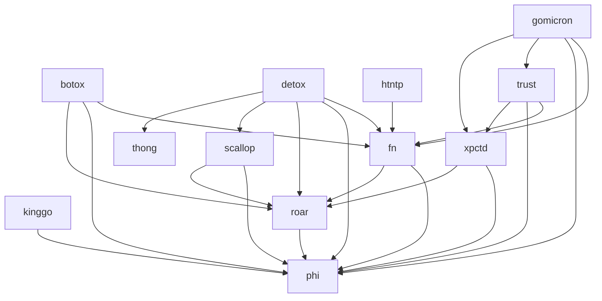

# going

**going** (referring to the "Perfect Continuous Future" tense of the verb **go**)
aims to provide much-needed language utilities to enable faster development
and design of Go applications on top of the Golang's standard library.

This project contains several libraries that can be used individually.

- [botox](./botox/README.md): DI framework using generics
- [detox](./detox/README.md): Mock framework using generics
- [fn](./fn/README.md): Functional patterns utilities
- [gomicron](./gomicron/README.md): Helpers to simplify onsi/gomega custom matcher creation
- [htntp](./htntp/README.md): Standard http library helpers 
- [kinggo](./kinggo/README.md): Test helpers for onsi/ginkgo
- [phi](./phi/README.md): Reflection utilities
- [roar](./roar/README.md): Standardized error struct
- [scallop](./scallop/README.md): Slice utilities
- [thong](./thong/README.md): String utilities
- [trust](./trust/README.md): Generic validators and asserters
- [xpctd](./xpctd/README.md): Standardized expectation message builder

We aim at minimizing third party dependencies.

> At the moment, those include:
> - onsi/ginkgo (only for testing purposes + testing library)
> - onsi/gomega (only for testing purposes + testing library)
> - samber/lo

We also allow cross-references between the libraries.
Also, all libraries (apart from `kinggo` and `gomicron` themselves) should/could 
depend on `kinggo` and `gomicron` to build their tests.

# TODO: todo lib
- task runner logic

# TODO: roar
- review accumulate -> maybe a way to accumulate error
- stack trace
- tests

# TODO: keven lib
- map utilities (kv -> keve -> keven)



# Getting Started

## Usage

```shell
go get "github.com/SamuelCabralCruz/going"
```

## Contributing

```shell
mise tasks
```
