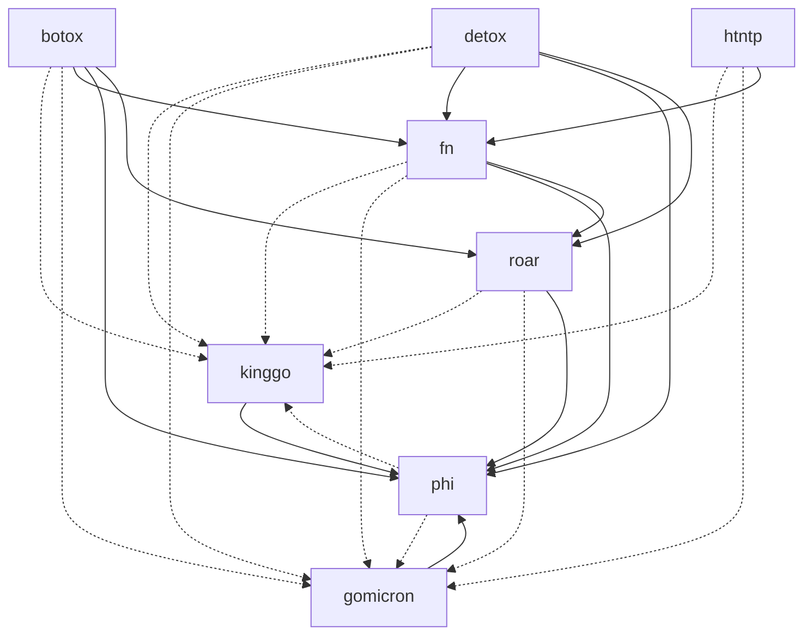

# went

**went** (past tense of the verb **go**) refers to the idea that using the
standard library of Golang is a thing of the past.

This project contains several libraries that can be used individually.

- [botox](./botox/README.md): DI framework using generics
- [detox](./detox/README.md): Mock framework using generics
- [fn](./fn/README.md): Functional patterns utilities
- [gomicron](./gomicron/README.md): Test helpers for onsi/gomega
- [htntp](htntp/README.md): Standard http library helpers 
- [kinggo](kinggo/README.md): Test helpers for onsi/ginkgo
- [phi](./phi/README.md): Reflection utilities
- [roar](./roar/README.md): Standardized error struct

We aim at minimizing third party dependencies.

> At the moment, those include:
> - onsi/ginkgo (only for testing purposes + testing library)
> - onsi/gomega (only for testing purposes + testing library)
> - samber/lo

We also allow cross-references between the libraries.

# TODO: testing
- create gomicron lib to simplify custom matchers creation

# TODO: tests
- roar
- fn
- botox
- detox

# TODO: fn
- optional ifPresent, ifAbsent, ifPresentOrElse
- implement pop function to remove first item from slice
- refactor optional and result to better leverage monads...
- simplify the mapping contract

# TODO: roar
- stack trace
- combine error? during chain
- review accumulate -> maybe a way to accumulate error



# Getting Started

## Usage

```shell
go get "github.com/SamuelCabralCruz/went"
```

## Contributing

```shell
make install
```
