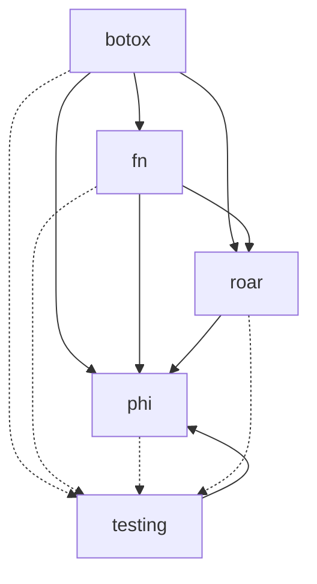

# went

**went** (past tense of the verb **go**) refers to the idea that using the
standard library of Golang is a thing of the past.

This project contains several libraries that can be used individually.

- [botox](./botox/README.md): DI framework
- [fn](./fn/README.md): Functional patterns utilities
- [phi](./phi/README.md): Reflection utilities
- [roar](./roar/README.md): Standardized error struct

We aim at minimizing third party dependencies.

> At the moment, those include:
> - samber/lo
> - onsi/ginkgo (only for testing purposes + testing library)
> - onsi/gomega (only for testing purposes + testing library)

We also allow cross-references between the libraries.

# TODO: remove mo -> create our own optional and result type

# TODO: combine error? during chain

# TODO: review accumulate -> maybe a way to accumulate error

# TODO: add tests everywhere

# TODO: makefile

# TODO: testing lib

# TODO: readme (how to contribute/getting started/setup local)

